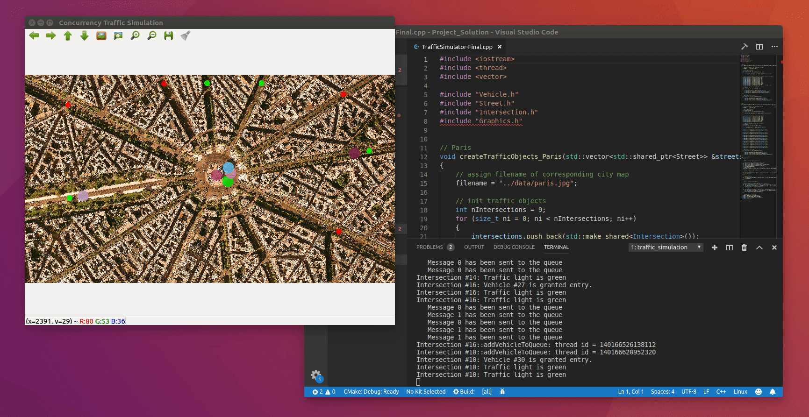

Concurrent Traffic Simulation
================


This project is part of the [C++ Nanodegree](https://www.udacity.com/course/c-plus-plus-nanodegree--nd213)
 program from Udacity. I develop a traffic simulation in which vehicles move
 along streets and cross intersections. Each intersection will be equipped with
 a traffic light. I built a suitable and thread-safe communication protocol
 between vehicles and intersections to complete the simulation.

<p align="center"></p>


### Install
To set up your environment to run the code in this repository, start by cloning
 this project using the `--recurse-submodules` flag. Afterward, install Docker
 in your machine and the appropriate Xserver. Then, start both and configure
 Xserver as explained [here](https://medium.com/@mreichelt/how-to-show-x11-windows-within-docker-on-mac-50759f4b65cb).
 You also may need to edit the environment variable [DISPLAY](https://medium.com/better-programming/running-desktop-apps-in-docker-43a70a5265c4)
 in the docker-compose files in the `dcomposes/` folder, depending on your
 operating system (and add `network_mode: "host"` if you are using [Linux](https://stackoverflow.com/questions/35960452/docker-compose-running-containers-in-nethost)).
 Currently, it is set up to work on the macOS. Finally, run the following
 commands. This will start an initial chatbot to test the environment.

```shell
$ make docker-build
$ make basic-simulator
```


### Run
In a terminal or command window, navigate to the top-level project directory
 `cpp-traffic-simulation/` (that contains this README) and run the following
 command, which will start a chatbot using the code implemented in this
 repository.

```shell
$ make complete-simulator
```


### License
The contents of this repository are covered under the [MIT License](LICENSE).

